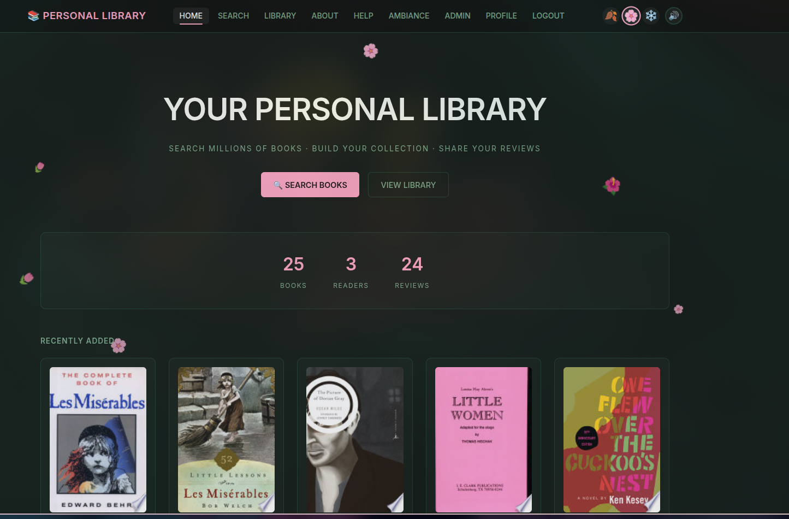

<h1 align="center">
  
  <br/>
  <br/>
  📚 Personal Library
</h1>

<p align="center">
  <em>Your personal Letterboxd — for books.</em>
</p>

<p align="center">
  
  
  
  
</p>

<p align="center">
  COMP-3250 · University of Windsor · 2026
</p>

---

## 📸 Dashboard

<!-- TODO: Replace with a screenshot of your live dashboard -->
<p align="center">
  
</p>

> 💡 **To add your screenshot:** Take a screenshot of your live site, save it as `images/dashboard.png`, and replace the placeholder above with:
> ```md
> 
> ```

---

## ✨ Features

- 🔍 **Book Search** — Search millions of books via the Google Books API
- 📖 **Personal Library** — Add books to your collection with cover art pulled automatically
- ⭐ **Reviews & Ratings** — Write reviews and rate books with a 1–5 star system
- 🎨 **3 Seasonal Themes** — Spring 🌸, Autumn 🍂, and Winter ❄️ with animated props
- 👤 **User Accounts** — Register, log in, and manage your own library
- 🛡️ **Admin Panel** — Manage users, books, and monitor site health
- 📱 **Fully Responsive** — Works on mobile and desktop

---

## 🛠️ Tech Stack

| Layer | Technology |
|-------|-----------|
| 🖥️ Backend | PHP (procedural) |
| 🗄️ Database | MySQL via MySQLi |
| 🎨 Frontend | HTML5, CSS3, Vanilla JS |
| 📚 External API | Google Books API |
| 🌐 Hosting | `myweb.cs.uwindsor.ca` |

---

## 🚀 Getting Started

### Prerequisites

- A LAMP stack (Apache + PHP 8.0+ + MySQL)
- A Google Books API key → [Get one here](https://developers.google.com/books/docs/v1/using#APIKey)

### Installation

```bash
# 1. Clone the repository
git clone https://github.com/<your-username>/personal_library.git
cd personal_library

# 2. Configure your database credentials
cp databaseConnectionVariables.php.example databaseConnectionVariables.php
# Edit databaseConnectionVariables.php with your DB host, user, password, and database name

# 3. Place files on your web server root
#    e.g. /var/www/html/ or your myweb.cs.uwindsor.ca public folder

# 4. Initialize the database — visit this URL once in your browser:
#    http://localhost/personal_library/createBooksTable.php

# 5. You're live! Navigate to:
#    http://localhost/personal_library/displayBooks.php
```

### 🔑 API Key Setup

Open `bookSearch.html` and replace the placeholder:
```js
const apiKey = "YOUR_GOOGLE_BOOKS_API_KEY_HERE";
```

---

## 📁 Project Structure

```
personal_library/
│
├── 📄 displayBooks.php          # Main library view (entry point)
├── 📄 bookSearch.html           # Google Books search
├── 📄 bookForm.php              # Add a book form
├── 📄 bookInsert.php            # Add a book handler
├── 📄 updateBookForm.php        # Edit book form
├── 📄 updateBook.php            # Edit book handler
├── 📄 deleteBookForm.php        # Delete book form
├── 📄 deleteBook.php            # Delete book handler
├── 📄 createBooksTable.php      # One-time DB setup
│
├── 🔐 register.php              # (planned) User registration
├── 🔐 login.php                 # (planned) Login
├── 🔐 profile.php               # (planned) User profile
├── ⭐ addReview.php             # (planned) Write a review
│
├── 🛡️ admin/                    # (planned) Admin panel
├── 📖 wiki/                     # (planned) Help wiki (5 pages)
│
├── 🎨 style.css                 # All styles + 3 seasonal themes
├── ⚙️ themes.js                 # Theme switcher + seasonal animations
│
├── 🖼️ images/                   # Static images + book covers
├── 🔒 databaseConnectionVariables.php  # DB credentials (gitignored)
└── 📋 docs/                     # Assignment rubric & description
```

---

## 🎨 Seasonal Themes

Switch themes using the palette icon in the navigation bar. Your choice is saved automatically.

| Theme | Season | Vibe |
|-------|--------|------|
| 🌸 **Spring** | March – May | Cherry blossom petals drifting |
| 🍂 **Autumn** | September – November | Leaves swirling and falling |
| ❄️ **Winter** | December – February | Snowflakes drifting peacefully |

---

## 📋 Assignment Checklist

<details>
<summary>Click to expand grading rubric progress</summary>

| Requirement | Points | Status |
|------------|--------|--------|
| Business case description (About page) | 0.5 | 🔲 |
| 20 products with 2+ options each | 1.0 | 🔲 |
| 3 switchable CSS templates | 4.0 | ✅ |
| Dynamic HTML forms (×2) | 2.0 | ✅ |
| PHP + MySQL documented | 5.0 | 🔲 |
| All code properly commented | 2.0 | 🔲 |
| Help wiki (5 pages) | 2.5 | 🔲 |
| Responsive menu | 1.0 | ✅ |
| 20+ HTML pages, 1 CSS, 1 JS, 20 images, 3 video/audio | 4.0 | 🔲 |
| Live URL | 0.5 | 🔲 |
| Advanced CSS (fonts, transitions, etc.) | 1.0 | ✅ |
| SEO meta tags | 1.0 | 🔲 |
| **Total** | **25** | |

</details>

---

## 👤 Author

**Daniel Laurin** — University of Windsor, COMP-3250

---

<p align="center">
  Made with ☕ and 📚
</p>
